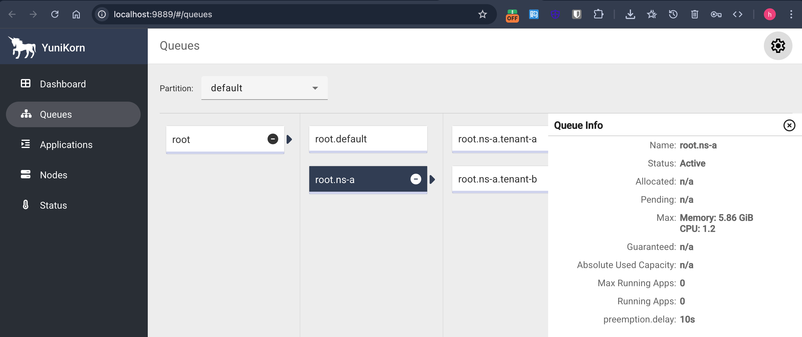
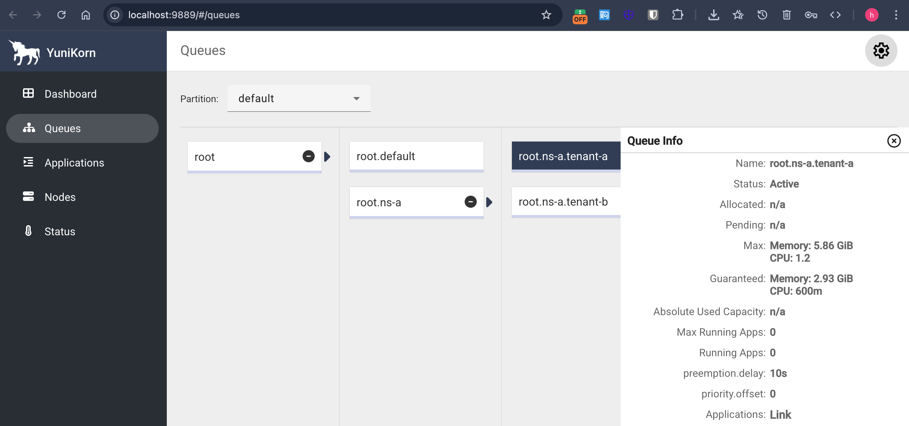
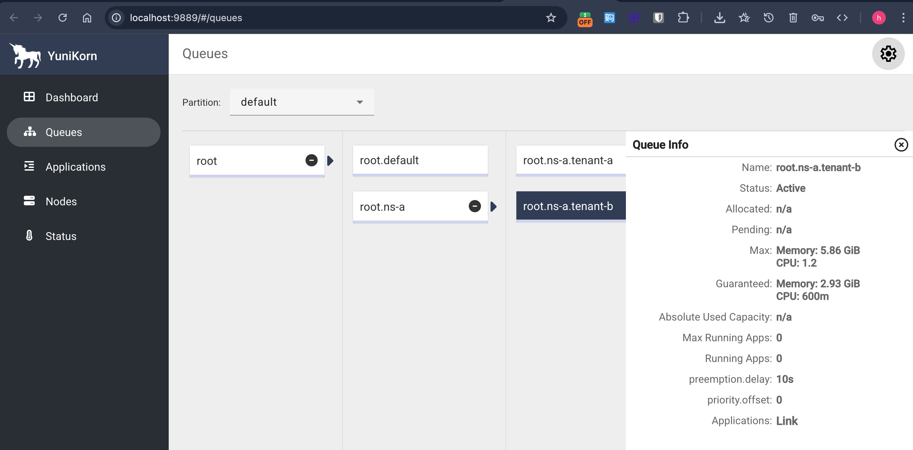

# set up yunikorn queue
### set up some child queues under a parent queue with the same priority, e.g. a paremt queue and 2 child queeus like this:




### a simple yunikorn-config example
```
apiVersion: v1
kind: ConfigMap
metadata:
  name: yunikorn-configs
  namespace: yunikorn
data:
  queues.yaml: |
    partitions:
      - name: default
        placementrules:
        - name: provided
        - name: fixed
          value: root.default
        queues:
        - name: root
          queues:
          - name: default
            submitacl: '*'
          - name: ns-a
            resources:
              max:
                {memory: 6000Mi, vcore: 1200m}
            properties:
              preemption.policy: fence
              preemption.delay: 10s
            queues:
            - name: tenant-a
              submitacl: '*'
              resources:
                max:
                  {memory: 6000Mi, vcore: 1200m}
                guaranteed:
                  {memory: 3000Mi, vcore: 600m}
              properties:
                priority.offset: "0"
            - name: tenant-b
              submitacl: '*'
              resources:
                max:
                  {memory: 6000Mi, vcore: 1200m}
                guaranteed:
                  {memory: 3000Mi, vcore: 600m}
              properties:
                priority.offset: "0"
```

# test long-runing large and short-running small spark jobs
### submit long-runing large spark job and put it on a child queue, e.g.
```
argo submit spark-pi-workflow.yaml \
    -p image=apache/spark:3.5.7 \
    -p partitions=100000 \
    -p namespace=yunikorn-spark-submit \
    -p executors=6 \
    -p queue=root.ns-a.tenant-a \
    -p scheduler=yunikorn
```
### submit short-running small spark job and put it on a child queue, e.g.
```
argo submit spark-pi-workflow.yaml \
    -p image=apache/spark:3.5.7 \
    -p partitions=1000 \
    -p namespace=yunikorn-spark-submit \
    -p executors=2 \
    -p queue=root.ns-a.tenant-b \
    -p scheduler=yunikorn
```

### spark-wf example
```
apiVersion: argoproj.io/v1alpha1
kind: Workflow
metadata:
  generateName: spark-pi-wf-
spec:
  entrypoint: spark-pi
  arguments:
    parameters:
    - name: queue
      value: root.default  # default value
    - name: image
      value: apache/spark:3.5.7
    - name: namespace
      value: yunikorn-spark-submit
    - name: partitions
      value: 10000
    - name: executors
      value: 1
    - name: scheduler
      value: default-scheduler
  templates:
  - name: spark-pi
    serviceAccountName: spark
    container:
      image: "{{workflow.parameters.image}}"
      command: ["/opt/spark/bin/spark-submit"]
      args:
      - --master
      - k8s://https://kubernetes.default.svc:443
      - --deploy-mode
      - cluster
      - --name
      - spark-pi
      - --conf
      - spark.kubernetes.container.image={{workflow.parameters.image}}
      - --conf
      - spark.kubernetes.namespace={{workflow.parameters.namespace}}
      - --conf
      - spark.kubernetes.authenticate.driver.serviceAccountName=spark
      - --conf
      - spark.executor.instances={{workflow.parameters.executors}}
      - --conf
      - spark.kubernetes.driver.request.cores=0.2
      - --conf
      - spark.kubernetes.driver.limit.cores=0.5
      - --conf
      - spark.driver.memory=1024m
      - --conf
      - spark.driver.memoryOverhead=200m
      - --conf
      - spark.kubernetes.executor.request.cores=0.2
      - --conf
      - spark.kubernetes.executor.limit.cores=0.5
      - --conf
      - spark.executor.memory=512m
      - --conf
      - spark.executor.memoryOverhead=100m
      - --conf
      - spark.kubernetes.scheduler.name={{workflow.parameters.scheduler}}
      - --conf
      - spark.kubernetes.driver.label.queue={{workflow.parameters.queue}}
      - --conf
      - spark.kubernetes.driver.label.yunikorn.apache.org/allow-preemption=false
      - --conf
      - spark.kubernetes.executor.label.queue={{workflow.parameters.queue}}
      - local:///opt/spark/examples/src/main/python/pi.py
      - "{{workflow.parameters.partitions}}"
```
note: set spark.kubernetes.driver.label.yunikorn.apache.org/allow-preemption=false, to prevent the driver from being preempted.