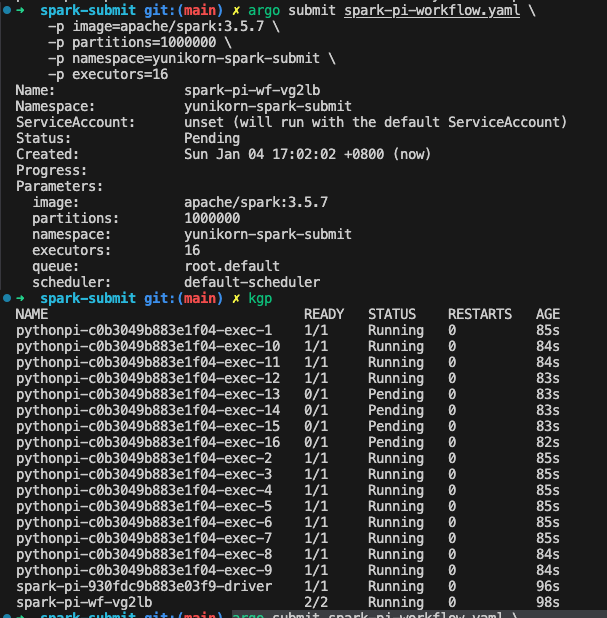
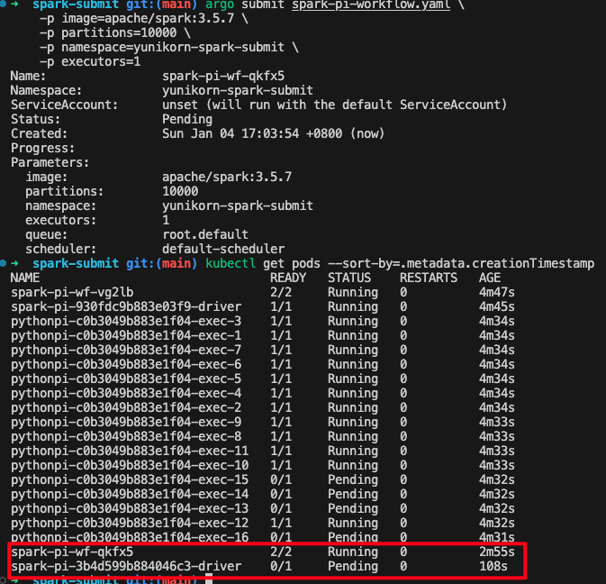
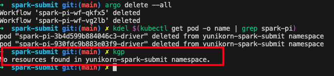
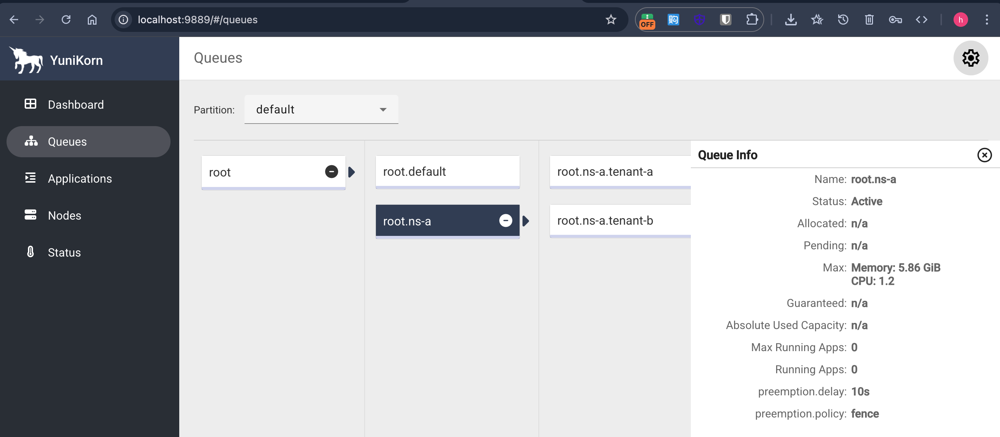
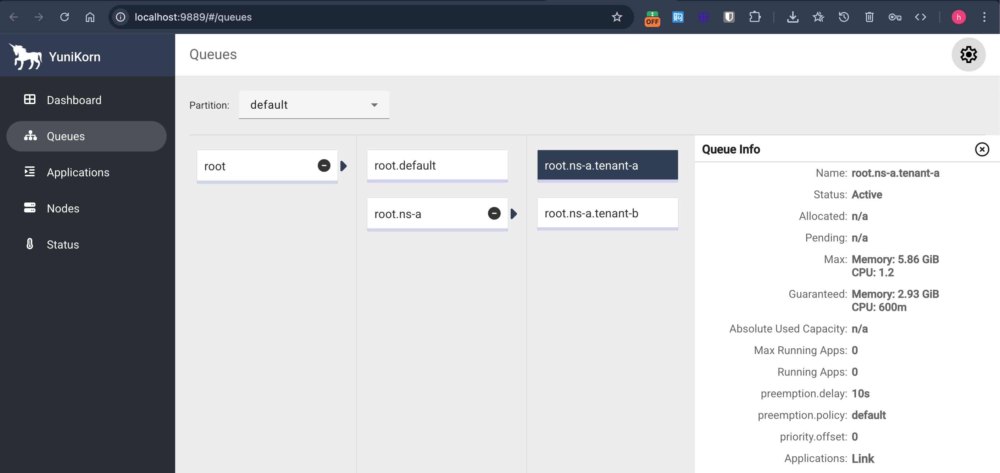
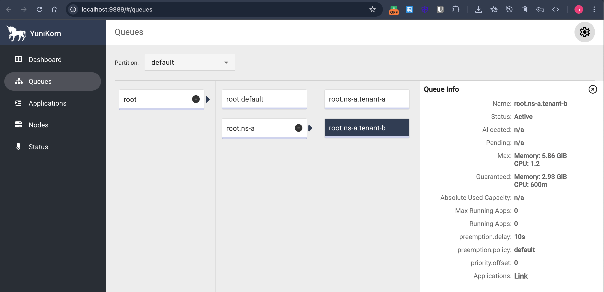
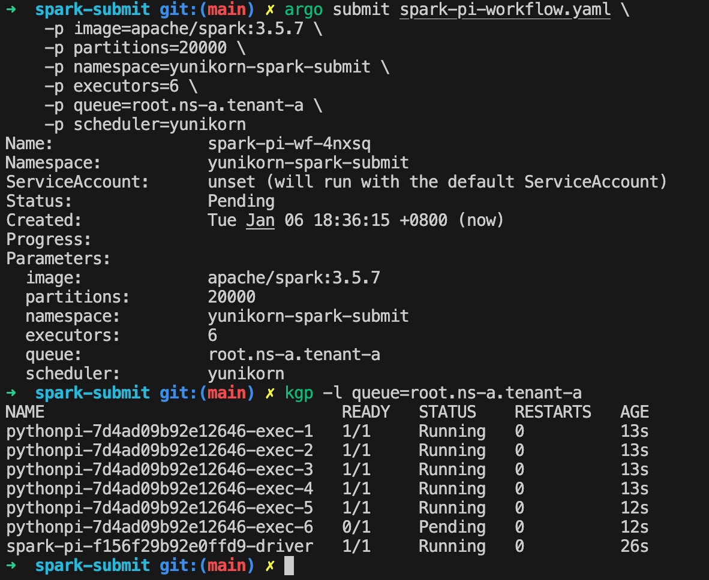
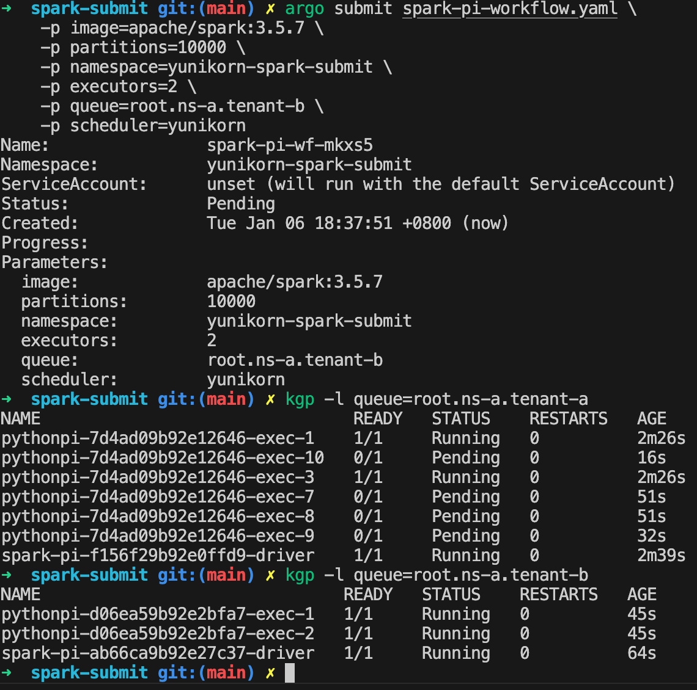

# Reproduce HOL(Head Of Line) blocking with default scheduler
argowf yaml: @spark-pi-workflow.yaml
### 1. simulate a large long-running spark job which consumes all(almost) resources:
```
argo submit spark-pi-workflow.yaml \
    -p image=apache/spark:3.5.7 \
    -p partitions=1000000 \
    -p namespace=yunikorn-spark-submit \
    -p executors=16
```
screenshot:


### 2. simulate a small short spark job, which we expect low latency:
```
argo submit spark-pi-workflow.yaml \
    -p image=apache/spark:3.5.7 \
    -p partitions=10000 \
    -p namespace=yunikorn-spark-submit \
    -p executors=1
```
screenshot:


## conclusion: 
with default scheduler and limited resources, there will be HOL blocking, large long-running spark jobs consume all resources will block future jobs in the same ns.

---

# Resolve HOL blocking with yunikorn

### 1. clear all workloads:


### 2. install yunikorn and config queues
parent queue:

child: root.ns-a.tenant-a

child: root.ns-a.tenant-b


### 3. simulate a large long-running spark job which consume all(almost) allocated resources:
specify yunikorn as the scheduler and the queue with low priority
```
argo submit spark-pi-workflow.yaml \
    -p image=apache/spark:3.5.7 \
    -p partitions=20000 \
    -p namespace=yunikorn-spark-submit \
    -p executors=6 \
    -p queue=root.ns-a.tenant-a \
    -p scheduler=yunikorn
```
wait for some momemt will see:


### 4. simulate a small short spark job, which we expect low latency:
specify yunikorn as the scheduler and the queue with normal priority, which is higher than the previous low priority queue, so can preempt pods from that queue
```
argo submit spark-pi-workflow.yaml \
    -p image=apache/spark:3.5.7 \
    -p partitions=10000 \
    -p namespace=yunikorn-spark-submit \
    -p executors=2 \
    -p queue=root.ns-a.tenant-b \
    -p scheduler=yunikorn
```
wait for some momemt will see:

1. sompe of the exec pods of the low priority job was preempted, and new ones created but in pending state.
2. the normal priority spark job was able to run, because it runs on a different queue with higher priority, and can preempt pods on the low priority queue when it consumes resources less than its guaranteed.

## conclusion: 
with yunikorn scheduler and prioritized queues, HOL blocking can be resolved, large long-running spark jobs running on low priority queues can be preempted by jobs running on higher priority queues. thus jobs with higher priority can get resource to execute.


